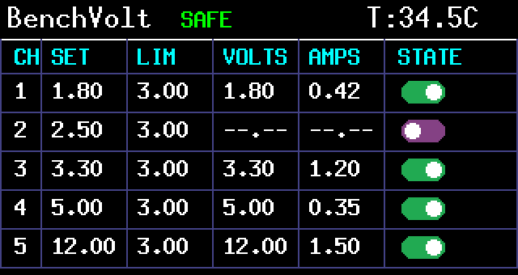
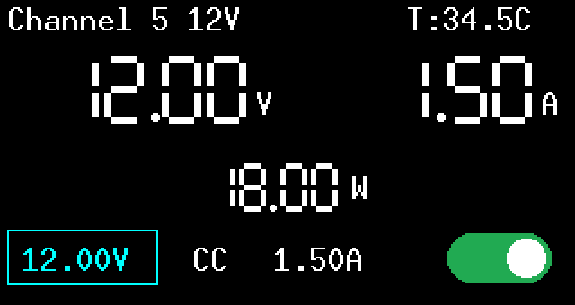
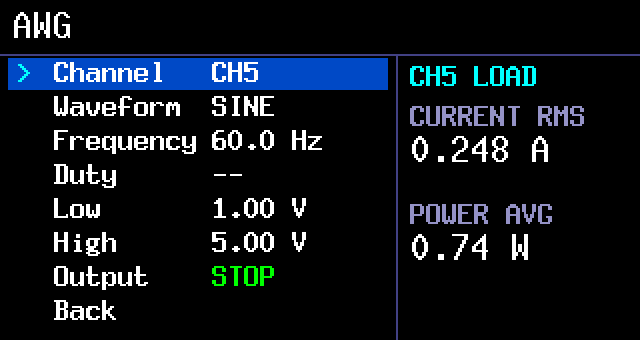
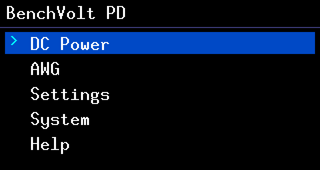

<div align="center">

  

  <br><br>

  

</div>

# BenchVolt-PD (Rust firmware fork)

[](https://github.com/jvanderberg/BenchVolt-PD/actions/workflows/ci.yml)

BenchVolt PD is an open-source, USB-C powered multi-channel lab power supply delivering up to 100 W. It has 5 outputs (0.5 V–22 V), STM32 control, USB-PD input, low-noise LDOs, and a Python control interface.

This repository is a fork of [sydundar/BenchVolt-PD](https://github.com/sydundar/BenchVolt-PD). All hardware design (PCB, schematics, enclosure) and the original C firmware are the work of the upstream author — full credit for the device itself belongs there. What this fork changes: **the C application firmware has been replaced with a new Rust firmware**, located at [`Firmware/Rust/benchvolt-pd`](Firmware/Rust/benchvolt-pd). The original C bootloader is retained and unmodified; the Rust application honors its partition and update contract, so firmware update over USB continues to work without an ST-LINK.

## Rust firmware

The Rust firmware is a ground-up rewrite built around a redux-style reducer architecture (using the [`reducto`](https://github.com/jvanderberg/reducto) crate): all state changes flow through typed actions and a pure reducer, a transition observer derives hardware effects from state transitions, and reducers/views never touch GPIO, I2C, ADC, or delays directly. Full detail is in the [firmware README](Firmware/Rust/benchvolt-pd/README.md).

Highlights:

- **Fail-closed hardware driver.** I2C NACKs, register mismatches, converter fault status, or GPIO readback mismatches all latch faults rather than continuing. Enable pins are verified at the electrical pin level, not the output latch.
- **Staged, dependency-aware power sequencing.** Shared pre-regulator rails are brought up before their dependent LDOs; a failed global shutdown escalates to a raw register-level emergency shutdown.
- **Protection.** Voltage/current sampled every 20 ms (temperature every 100 ms), with a 3-strike latching policy for current/voltage-window violations; invalid sensor readings fail immediately. USB-PD input overcurrent protection with a configurable sink limit. While a waveform runs, software sampling is suspended for waveform purity — the converters' cycle-by-cycle hardware OCP/OVP/SCP protect the run, and software protection re-arms when it stops.
- **Bounded voltage slew.** Live CH4/CH5 voltage edits slew the physical drive in verified 200 mV steps, with protection active throughout.
- **CV/CC modes on CH4/CH5.** Digital constant-current loops with a compliance-voltage ceiling; CC state is indicated on the overview and detail screens.
- **Remote control.** USB CDC SCPI-style command set (`*IDN?`, `MEAS:CHn?`, `OUTP:CHn ON/OFF`, `SOUR:CURR`, `SOUR:MODE`, waveform control, protection/diagnostic queries, `JUMP:BOOTLOADER`, and more). Output commands acknowledge only after the hardware transition actually completes. Full reference: [SCPI interface documentation](Docs/scpi-interface.md).
- **AWG.** Square, triangle, ramp, and sine waveforms on CH4/CH5 from a 2 kHz scheduler — square to 125 Hz, other shapes to 120 Hz — controllable from the front panel or over USB (`SOUR:WAVE:CHn:FUNC`/`RUN`/`STOP`), plus a desktop-compatible arbitrary-waveform upload (up to 1024 validated points).
- **Persistence.** Versioned, CRC-checked append-only settings journal in a reserved flash page (current limits, setpoints, modes, PD limit, units), three profile slots, and safe deferred compaction. Torn or corrupt records are ignored.
- **UI.** Rotary-encoder-driven menu system with overview, per-channel detail, AWG, settings, system, help, and USB-PD input screens; encoder acceleration; coalesced detent handling so display work never drops a quick spin.
- **Bootloader compatibility.** Links at `0x08008000` within the 92 KiB application partition; the update path cannot touch the bootloader, settings page, or boot-metadata page. The boot seal written by the bootloader stays valid across power interruptions, so the device always returns to the application; `JUMP:BOOTLOADER` (or SWD) is the way back into the bootloader.

### Firmware screenshots

All screenshots are rendered by the actual firmware view code via the host-side
simulator in [`tools/render`](Firmware/Rust/benchvolt-pd/tools/render).



The DC power overview: setpoints, current limits, and live measurements for all
five channels, with per-channel output toggles. Channel 2 is off, so it reads
0.00 V / 0.00 A. The header shows the protection status and board temperature.



The channel detail screen for CH5: large live voltage, current, and power
readouts, with the voltage setpoint focused for editing. The `CC` badge shows
the channel is in constant-current regulation.



The arbitrary waveform generator configured for a 60 Hz sine on CH5. While a
waveform runs, the firmware keeps the loop dedicated to the 2 kHz sampler —
display updates and background monitoring are suspended for waveform purity.



Menu flow: from the main menu into DC power, paging to Channel 5, focusing the
voltage field, dialing the setpoint up, and switching the output on.

## Hardware overview


At power-on, all regulators and converters start disabled. The STM32 microcontroller powers up first, performs safety checks by monitoring temperature, current, and voltage, and then enables the DC-DC converters followed by the linear regulators in sequence. Throughout operation the MCU continuously monitors all system parameters.

An additional safety layer can be applied by setting a power limit on the USB-PD input, configurable from the on-screen menu / rotary encoder or from the desktop interface.

Each DC-DC converter is monitored so that no more than 5 A is drawn from its output. The 1.8 V and 2.5 V LDOs share the same 3 V / 5 A pre-regulator rail, while the 3.3 V and adjustable (0.5 V–5.5 V) LDOs share the 5.5 V / 5 A rail. When both LDOs on the same rail are heavily loaded, their combined output current should not exceed 5 A total (typically below 3 A per channel). Both the original C firmware and the Rust firmware program the first pre-regulator to 3.0 V; older documentation calling it a 4 V rail was stale.

The third buck-boost output (0.8 V–22 V) operates independently and delivers up to 3 A. Since this channel's output comes directly from the DC-DC converter, its ripple and noise are relatively higher; overall stability and performance remain excellent for most applications. The other outputs, regulated through LDOs, provide exceptionally low ripple — clean and stable voltages for sensitive analog and digital circuits.

Notes:

- In theory the system can deliver up to 100 W total, but conversion and regulation losses in the DC-DC converters and LDOs mean the full 100 W cannot be used.
- The maximum achievable power depends on the connected USB-PD adapter and cable — a 65 W charger caps the system at 65 W.

### Features and specifications

#### Power and outputs
- Five independent output channels with adjustable voltage and current
- Fixed outputs: **1.8 V, 2.5 V, 3.3 V @ up to 3 A**
- Adjustable output 1: **0.5 V–5 V @ up to 3 A**
- Adjustable output 2: **0.8 V–22 V @ up to 3 A**
- 2.54 mm (100 mil) pin headers for powering multiple evaluation boards
- Arbitrary waveform generation and predefined waveforms (square, sine, triangle, ramp) on the adjustable channels

#### Arbitrary waveforms
- Number of points: **1024**
- Resolution: **12-bit**
- Point parameters: **dwell time** and **voltage**
- Repetition: finite counts or continuous
- Example waveform files in [`ExampleARBFiles/`](ExampleARBFiles)

#### USB Power Delivery
- USB-C input supporting **PD sink mode**
- Up to **100 W** USB-PD power input

#### Controls
- **1.9″ TFT display (170 × 320)** for real-time voltage, current, and PD status
- **Rotary encoder** for menu navigation and fine adjustments
- **SCPI-style command support** for remote programming over USB CDC
- **Python GUI** for desktop monitoring and control

#### Electronics
- **Microcontroller:** STM32F070RB (Arm Cortex-M0 @ 48 MHz, 128 KiB flash, 16 KiB RAM, LQFP64)
- **USB-PD controller:** STUSB4500 (sink mode)
- Configurable LDOs and buck/boost converters for output regulation
- Over-current protection on all channels
- Firmware upgradeable via USB (no ST-LINK required)

## Building

### Firmware

The Rust firmware targets `thumbv6m-none-eabi`, selected automatically by the crate's `.cargo/config`:

```sh
rustup target add thumbv6m-none-eabi
cd Firmware/Rust/benchvolt-pd
cargo build --release
```

This produces an image linked at `0x08008000` for the existing C bootloader. See the [firmware README](Firmware/Rust/benchvolt-pd/README.md) for image generation and the USB flashing runbook (`tools/flash_latest.sh`).

### Installing firmware

The firmware ships with its own boot chain
([design](Docs/v2-bootloader-design.md)): a frozen trampoline, a recovery
core, and a worker core that shows an on-screen updater, with a 104 KiB
application partition. Every update is power-glitch-safe, the updater
shares the device's normal USB identity (one port name, no new
authorization prompts), and a device with broken firmware always falls
back to an updater.

No programming hardware is needed:

1. Download `benchvolt-v2.bin` from the
   [latest release](https://github.com/jvanderberg/BenchVolt-PD/releases/tag/latest).
   (For offline use, also grab `migrator.bin` into the same folder — the
   boot-chain installer a factory device needs once. Online, the GUI
   fetches it automatically when required.)
2. Power the device from a mains supply (not a power bank) and connect USB.
3. In the desktop GUI: select the device's port, open the Firmware Update
   tab, browse to `benchvolt-v2.bin`, and press **START SMART UPDATE**.

On a stock device the GUI first installs the boot chain through the
factory bootloader (the screen shows **MIGRATING — DO NOT UNPLUG**; this
one-time step is the only moment where losing power requires an SWD probe
to recover), then uploads the firmware and reconnects automatically. On a
device that already has the boot chain, the same button just updates the
firmware. Command line equivalent:
`python3 Firmware/Rust/boot-v2/tools/flash_v2.py <port> benchvolt-v2.bin 0 --boot`
(enter the updater first with `JUMP:BOOTLOADER` /
`tools/enter_bootloader.py`).

Recovery: an interrupted install resumes by pressing START again; a failed
upload leaves the device in the updater — retry. Holding the encoder
button for one second while plugging in forces the updater even with
working firmware. The GUI checks that an image matches the device's
bootloader generation and refuses mismatches.

### Desktop GUI

The original desktop GUI ([`GUI/BenchVolt-PD.py`](GUI), Python/customtkinter) works with the Rust firmware, including firmware update over USB.

## Repository layout

| Path | Contents |
| --- | --- |
| [`Firmware/Rust/benchvolt-pd`](Firmware/Rust/benchvolt-pd) | Rust application firmware (this fork's main change) |
| [`Firmware/`](Firmware) | C bootloader and archived original C application firmware |
| [`Schematics/`](Schematics) | Block diagram and full schematic PDF (r3) |
| [`Enclosure/`](Enclosure) | STL files for the acrylic/aluminium enclosure |
| [`Docs/`](Docs) | User manual, safety instructions, DoC, and errata |
| [`GUI/`](GUI) | Python desktop control application |
| [`ExampleARBFiles/`](ExampleARBFiles) | Example arbitrary-waveform files |
| [`Images/`](Images) | Photos and firmware screenshots |

## Credits and license

- Hardware design, enclosure, desktop GUI, and the original C firmware: [sydundar/BenchVolt-PD](https://github.com/sydundar/BenchVolt-PD) — please see the upstream project for the canonical hardware documentation and to support the original author.
- Rust firmware and this fork: [jvanderberg/BenchVolt-PD](https://github.com/jvanderberg/BenchVolt-PD), built on the [`reducto`](https://github.com/jvanderberg/reducto) reactive-architecture crate.
